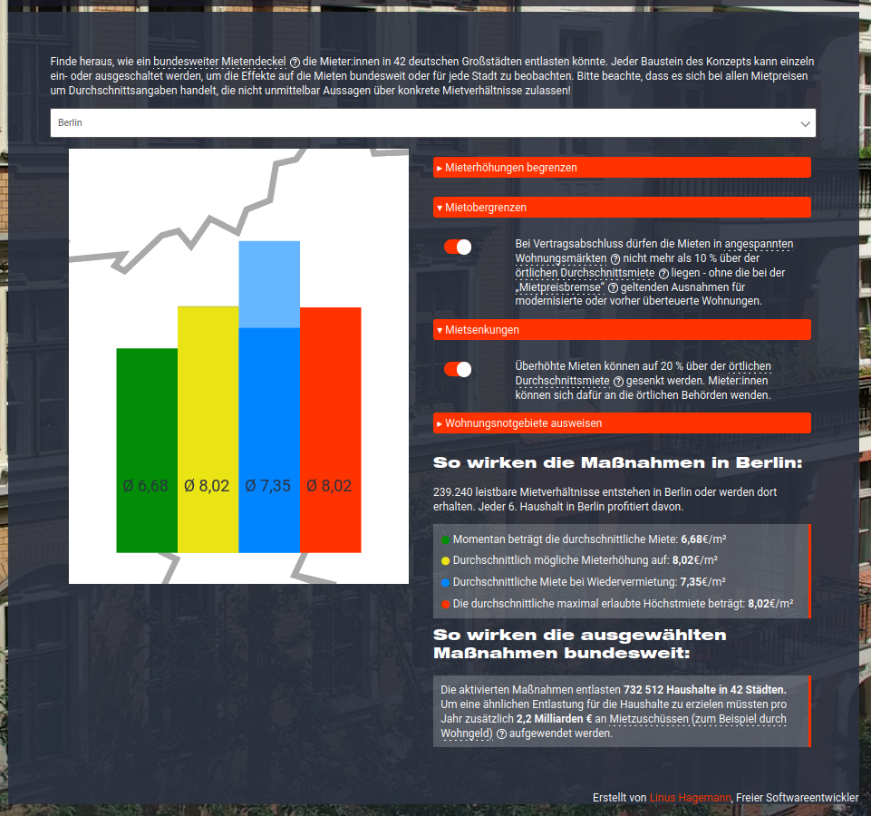

# How Would a Federal Rent Cap Work?

## What is this?

This repository contains code for an interactive explanation/visualization of the effects a federal rent cap would have in Germany.
The visualization shows the concept presented in ["Bundesweiter Mietendeckel - Regelungsmöglichkeiten und Beitrag für eine soziale Wohnraumversorgung. Studie im Auftrag der Bundestagsfraktion DIE LINKE und der Rosa-Luxemburg-Stiftung. Holm, Raabe, Hölzel, Sprengholz. 2021"](https://www.rosalux.de/fileadmin/rls_uploads/pdfs/sonst_publikationen/Studie_bundesweiter_Mietendeckelerfassung.pdf).
It was developed as part of my three-month internship at the [Institute for Critical Social Analysis](https://www.rosalux.de/en/foundation/ifg) in 2021.

The live version can be tried on the [website of the RLS](https://rosalux.de/mietendeckel).

## How to use it?

The visualization was developed with the goal of being embedded on the website of the [Rosa-Luxemburg-Foundation](https://www.rosalux.de/en/). Thus, if you want to run this code locally, you will need to adapt some paths that are currently loading assets directly from there.

This also leads to the styling probably looking weird if run locally, since the rules in the `.css` file are mere additions to the overall styles being applied to the site.

If you want to run this locally, you will need to have `d3` installed, or you install it based on the projects `package.json` and lockfile. Bundling is not necessary to run the application. Just open the `.html` file in your browser.

## Dependencies

Thanks to 
- [`d3.js`](https://d3js.org/)
- [`sweetaler2`](https://sweetalert2.github.io/)
- [`select-pure`](https://dudyn5ky1.github.io/select-pure/) 
- geoJSON data for Germany was thankfully taken from [isellsoap/deutschlandGeoJSON](https://github.com/isellsoap/deutschlandGeoJSON).

Some code was also more or less verbatim inspired from [here](https://www.w3schools.com/howto/howto_css_switch.asp) and I want to point out the [3D Graph Gallery](https://www.d3-graph-gallery.com/) which was a great starting point into all things d3!

## License

Copyright for the presented concept as well as the used rent-data lies with the original authors/as stated in the original study (see above).
Please be aware that the contents of this repository otherwise are explicitly not licensed.

All code © Linus Hagemann, 2021.